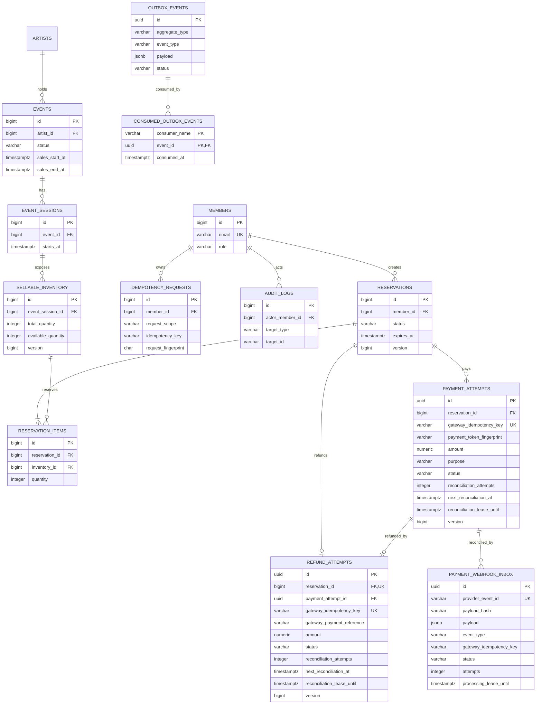

# MVP 데이터 모델

초기 MVP는 지정 좌석이 아닌 수량 기반 티켓과 굿즈 재고를 같은 판매 재고로 다룬다.

## 불변식

- `available_quantity`는 0 이상이며 `total_quantity`를 초과할 수 없다.
- 한 예약에서 같은 재고는 하나의 항목으로만 존재한다.
- 멱등키는 회원·요청 범위 안에서 유일하다.
- 결제 시도의 PG 멱등키는 유일하며 결제 토큰 원문은 저장하지 않는다.
- 결과 불명 결제는 PG 승인 API를 재호출하지 않고 조회 기반 수동·자동 대사로만 수렴시킨다.
- 예약별 환불 시도는 한 건이며 결과 불명 동안 예약은 `CONFIRMED`, 재고는 선점 상태를 유지한다.
- 환불 성공이 확인된 트랜잭션에서만 예약 취소·재고 반환·Outbox를 함께 반영한다.
- 자동 대사는 만료 가능한 처리 임대와 다음 실행 시각으로 다중 인스턴스 중복 조회와 장애 고착을 막는다.
- 서명을 통과한 PG 웹훅은 event ID와 payload hash로 멱등성을 판정하고, Inbox 임대 시도 번호가 늦은 작업자의 상태 덮어쓰기를 막는다.
- 만료 후 승인된 결제는 예약별 한 건인 `LATE_PAYMENT_COMPENSATION` 환불로 연결되며 예약·재고 상태를 변경하지 않고 금전 상태만 환불로 수렴시킨다.
- 만료 조회와 Outbox 폴링은 부분 인덱스로 활성 상태만 탐색한다.
- Outbox 소비 이력은 소비자명·이벤트 ID 조합으로 유일해 DB 부작용의 중복 반영을 막는다.
- 애플리케이션 상태 전이는 도메인 로직이, 값의 최소 안전선은 DB 제약조건이 보호한다.
