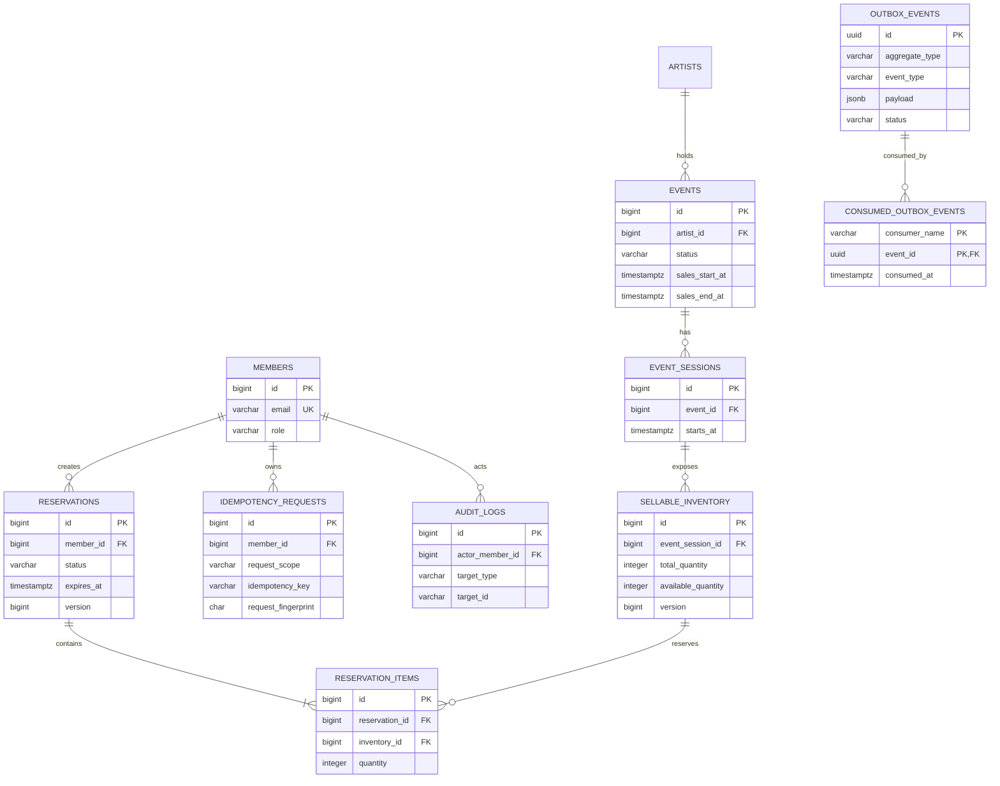

# MVP 데이터 모델

초기 MVP는 지정 좌석이 아닌 수량 기반 티켓과 굿즈 재고를 같은 판매 재고로 다룬다.

## 불변식

- `available_quantity`는 0 이상이며 `total_quantity`를 초과할 수 없다.
- 한 예약에서 같은 재고는 하나의 항목으로만 존재한다.
- 멱등키는 회원·요청 범위 안에서 유일하다.
- 만료 조회와 Outbox 폴링은 부분 인덱스로 활성 상태만 탐색한다.
- Outbox 소비 이력은 소비자명·이벤트 ID 조합으로 유일해 DB 부작용의 중복 반영을 막는다.
- 애플리케이션 상태 전이는 도메인 로직이, 값의 최소 안전선은 DB 제약조건이 보호한다.
