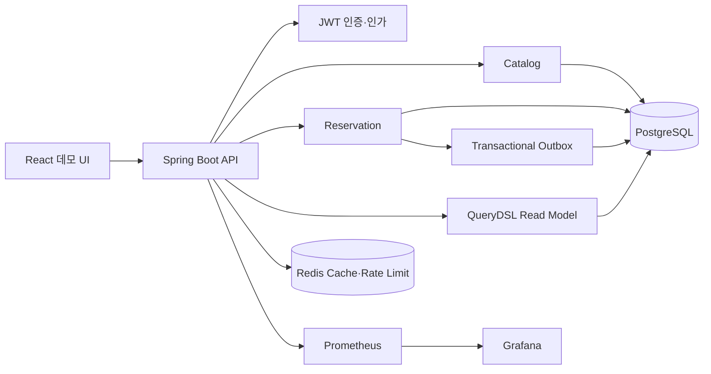

# StagePass 백엔드 포트폴리오 요약

## 한 문장 소개

StagePass는 공연·팬 이벤트의 한정 재고를 여러 사용자가 동시에 예약할 때도 초과 판매 없이 선점하고, 중복 요청·만료·비동기 재처리·운영 장애까지 다루는 Spring Boot 예약 플랫폼이다.

## 시스템 경계

모듈형 모놀리스 안에서 Catalog, Member, Reservation, Payment, Idempotency, Outbox 경계를 나눴다. JPA는 애그리거트 상태 전이와 쓰기 트랜잭션에, QueryDSL은 검색 조건·DTO projection·집계에 사용했다.

## 해결한 백엔드 문제

| 문제 | 선택 | 검증 근거 |
|---|---|---|
| 동시 예약의 초과 판매 | `available_quantity >= 요청량` 조건부 단일 UPDATE | 경쟁 요청에서도 음수 재고 0건 |
| 네트워크 재시도의 중복 결제 | 회원·scope·key 기반 멱등 요청과 fingerprint | 같은 요청 결과 재생, 다른 body는 409 |
| 만료 예약의 중복 재고 반환 | `FOR UPDATE SKIP LOCKED` 배치 선점 | 복수 작업자와 롤백 재실행 테스트 |
| 상태 변경과 후속 처리 유실 | Transactional Outbox + 소비 이력 | 실패 백오프·임대 회수·중복 소비 테스트 |
| 관리자 다조건 조회 | QueryDSL DTO projection과 전용 인덱스 | 10,000건 실행 계획과 SQL 횟수 검증 |
| 사용자 예약 정보 노출 | JWT 소유권 범위 + QueryDSL 읽기 모델 | 목록·상세 각 SQL 2회, 타인 예약 동일 404 |
| 깊은 페이지의 offset 비용 | `(created_at, id)` row-value cursor | 50,000건 49,001번째 기준 p50 3.067ms → 0.213ms |
| Redis 장애 전파 | Cache-Aside fallback, rate-limit fail-open | Redis 예외 시 DB 원본 기능 유지 테스트 |
| 장애 추적 단절 | X-Request-Id, MDC, 도메인 메트릭 | Prometheus endpoint와 Grafana 7개 패널 검증 |
| 구현과 API 문서의 표류 | 컨트롤러 기반 OpenAPI와 대상별 계약 그룹 | 공개·회원·관리자 경로와 JWT 요구 사항 회귀 테스트 |
| 운영 용량·정합성 회귀 | Docker k6 + 종료 후 SQL invariant | 상세 p95 12.66ms, 경합 p95 68.22ms, 초과 판매 0 |

## 이력서용 3줄

- PostgreSQL 조건부 UPDATE와 `FOR UPDATE SKIP LOCKED`를 적용해 고경합 한정 재고의 초과 판매를 방지하고, 예약 만료를 다중 인스턴스에서 안전하게 병렬 처리했습니다.
- JPA 쓰기 모델과 QueryDSL 읽기 모델을 분리하고 50,000건 데이터로 cursor pagination을 측정해 깊은 페이지 p50을 3.067ms에서 0.213ms로 개선했습니다.
- 멱등키, Transactional Outbox, Redis 장애 fallback과 Prometheus/Grafana 관측 체계를 구축하고 Testcontainers 기반 통합 테스트로 재시도·롤백·장애 시나리오를 검증했습니다.

## 면접용 STAR 이야기

### 상황

인기 공연 오픈 직후 같은 재고에 요청이 몰리고, 사용자의 재시도와 예약 만료 작업까지 동시에 실행되는 상황을 가정했다. 단순 조회 후 차감은 초과 판매를 만들고, 긴 비관적 잠금은 응답 지연과 처리량 저하를 유발할 수 있었다.

### 과제

재고 정합성을 보장하면서 잠금 대기 시간을 줄이고, 요청 재전송과 배치 재실행에도 결제·재고 반환 부작용을 한 번만 실행해야 했다.

### 행동

재고 차감을 수량 조건이 포함된 단일 UPDATE로 바꾸고 영향 행이 0이면 재고 부족으로 처리했다. 예약 생성과 확정에는 요청 fingerprint 기반 멱등키를 적용했다. 만료와 Outbox 폴링은 작은 batch를 `SKIP LOCKED`로 선점하고 처리 임대와 지수 백오프를 추가했다. 대안은 ADR에 남기고 경쟁 요청·롤백·중복 전달을 자동 테스트로 재현했다.

### 결과

경쟁 요청에서 초과 판매 없이 가능한 수량만 성공했고, 동일 요청과 이벤트 재전달에도 결과가 한 번만 반영됐다. 운영자는 요청 ID와 재고 충돌·Outbox backlog 지표로 병목을 좁힐 수 있게 됐다.

## 7분 시연 순서

1. React 화면에서 `ON_SALE` 이벤트와 잔여 재고를 확인한다.
2. 사용자 계정으로 1매를 선점하고 예약 만료 시각과 감소한 재고를 확인한다.
3. 같은 예약을 모의 결제로 확정한 뒤 관리자 계정으로 전환한다.
4. 내 예약 목록과 상세에서 상태·공연·회차·가격 스냅샷을 확인한다.
5. 운영 콘솔에서 확정 건수, 매출, 최근 예약, 잔여 재고를 확인한다.
6. 테스트의 경쟁 재고·멱등·Outbox 시나리오와 실행 결과를 보여준다.
7. Swagger UI의 대상별 계약과 Grafana·cursor 실행 계획·장애 복구 런북으로 설계 판단을 마무리한다.

## 남은 위험과 확장 순서

- 데모 UI의 토큰 저장소를 HttpOnly cookie 기반 BFF로 변경한다.
- 결제 gateway를 외부 sandbox와 연결하고 승인·취소 webhook 멱등성을 검증한다.
- 운영 topology에서 장시간 부하를 재측정하고 실제 SLO에 맞춰 경보 기준을 조정한다.
